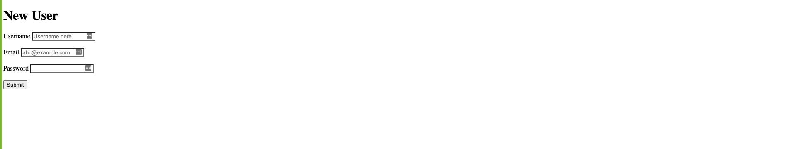
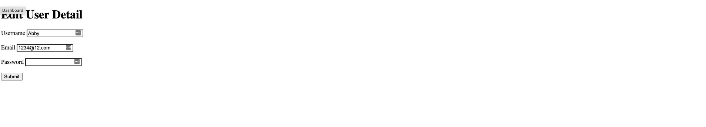
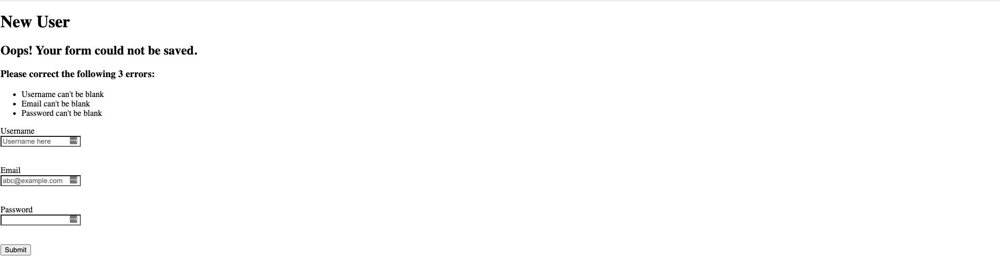
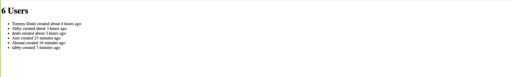

# Bare Metal Forms and Helpers

> In this project, we built a form the old fashioned way and then the Rails way.






## Built With

- Ruby on Rails
- Ruby
- Rubocop

# Getting Started

To get a local copy of the repository please run the following commands on your terminal:

```
$ cd <folder>
```

```bash
$ git clone `git@github.com:Amita-Roy/bare_metal_forms_and_helpers.git`
$ cd bare-metal_forms_and_helpers
$ bundle install
$ yarn install --check-files
$ Run `rails db:migrate` to create necessary tables in database
```

# Authors

👤 **Ahmad Chata**

- Github: [@Ahmad](https://github.com/ahmadchata)
- Twitter: [@Ahmad](https://twitter.com/AhmadChata)
- Linkedin:[@Ahmad](http://linkedin.com/in/ahmad-chata-957b9b51)

👤 **Amita Roy**

- Github:[@Amita](https://github.com/Amita-Roy)
- Twitter:[@Amita](https://twitter.com/AmitaRoy14)
- Linkedin:[@Amita](https://www.linkedin.com/in/amita-roy-3b823b68/)

## 🤝 Contributing

Contributions, issues and feature requests are welcome!

## Show your support

Give a ⭐️ if you like this project!
